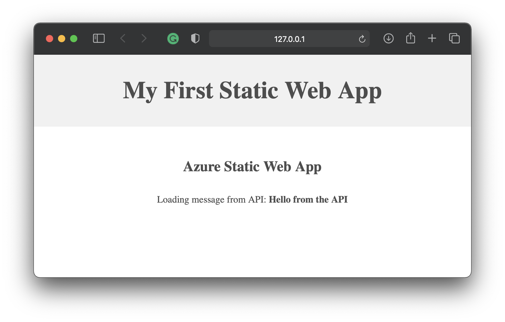

# My Static Web App
Triển khai ứng dụng Web trên dịch vụ nền tảng điện toán đám mây.
(Đây là phần thực hành của nội dung chương 4 trong học phần *Điện toán đám mây và ứng dụng* đang được giảng dạy tại Khoa Công nghệ thông tin của Trường Đại học Mỏ - Địa chất)

## Giới thiệu
**Azure Static Web Apps** là một dịch vụ nền tảng điện toán đám mây của Microsoft cho phép chúng ta xây dựng các ứng dụng web hiện đại, tự động xuất bản từ những thay đổi được thực hiện ngay trong **GitHub Actions**.

Trong bài viết này, tôi sẽ tiến hành xây dựng một ứng dụng web và triển khai nó theo giải pháp điện toán đám mây của **Microsoft Azure Portal**.

Đây là ứng dụng mà tôi sẽ xây dựng trong bài viết này


Nó trông thực sự rất đơn giản nhưng ứng dụng này lại được xây dựng và triển khai tự động trên dịch vụ nền tảng điện toán đám mây sử dụng GitHub Actions.

Nó có một API trả về một lời chào đơn giản nhưng không cần máy chủ như truyền thống mà nó được triển khai theo mô hình thực thi điện toán đám mây của Microsoft Azure Portal và được thực hiện bởi dịch vụ Azure Static Web Apps.

Sau bài thực hành này, bạn có thể thực hiện một số điều sau đây với Azure Static Web Apps:

- Xây dựng các ứng dụng web hiện đại với các framework và thư viện JavaScript như [Angular](https://docs.microsoft.com/en-us/azure/static-web-apps/getting-started?tabs=angular), [React](https://docs.microsoft.com/en-us/azure/static-web-apps/getting-started?tabs=react), [Svelte](https://docs.microsoft.com/en-us/learn/modules/publish-app-service-static-web-app-api/), [Vue](https://docs.microsoft.com/en-us/azure/static-web-apps/getting-started?tabs=react) hoặc sử dụng [Blazor](https://dotnet.microsoft.com/apps/aspnet/web-apps/blazor) để tạo các ứng dụng WebAssembly với một back-end bằng các [Azure Functions](https://docs.microsoft.com/en-us/azure/static-web-apps/apis).

- Xuất bản các trang web tĩnh với các frameworks như [Gatsby](https://docs.microsoft.com/en-us/azure/static-web-apps/publish-gatsby), [Hugo](https://docs.microsoft.com/en-us/azure/static-web-apps/publish-hugo), [VuePress](https://docs.microsoft.com/en-us/azure/static-web-apps/publish-vuepress).

- Triển khai các ứng dụng web với các frameworks như [Next.js](https://docs.microsoft.com/en-us/azure/static-web-apps/deploy-nextjs) và [Nuxt.js](https://docs.microsoft.com/en-us/azure/static-web-apps/deploy-nuxtjs).

## Mở đầu
Azure Static Web Apps xuất bản ứng dụng web cho người dùng bằng cách xây dựng các ứng dụng từ kho quản lý và lưu trữ mã nguồn GitHub. Trong phần mở đầu này, chúng ta triển khai ứng dụng web cho Azure Static Web Apps bằng công cụ môi trường viết mã Visual Studio Code.

### Điều kiện tiên quyết
- Có tài khoản [GitHub](https://github.com/)
- Có tài khoản [Azure](https://portal.azure.com/)
- Môi trường viết mã [Visual Studio Code](https://code.visualstudio.com/)
- Phần mềm quản lý mã nguồn [Git for Windows](https://git-scm.com/downloads) hoặc [Git for macOS](https://git-scm.com/download/mac). Nếu bạn đã cài đặt Git, bạn có thể tải phiên bản phát triển mới nhất thông qua chính lệnh Git: ```git clone https://github.com/git/git```.
- [Azure Static Web Apps extension](https://marketplace.visualstudio.com/items?itemName=ms-azuretools.vscode-azurestaticwebapps) cho Visual Studio Code
- [Azure Functions extension](https://marketplace.visualstudio.com/items?itemName=ms-azuretools.vscode-azurefunctions) cho Visual Studio Code

- [Live Server extension](https://marketplace.visualstudio.com/items?itemName=ritwickdey.LiveServer) cho Visual Studio Code

### Tạo một kho lưu trữ
Bài viết này sử dụng kho lưu trữ mẫu (template) GitHub để giúp bạn dễ dàng bắt đầu. Mẫu có một ứng dụng web tĩnh rất đơn giản để chúng ta có thể sử dụng như một điểm khởi đầu.

> 1. Đảm bảo rằng bạn đã đăng nhập vào GitHub và điều hướng đến vị trí sau để tạo một kho lưu trữ mới:
https://github.com/chuyentt/paas-basic/generate - nếu liên kết không hoạt động, vui lòng đăng nhập vào GitHub và thử lại.
> 2. Đặt tên cho Repository name (kho lưu trữ mã nguồn) của bạn là:
`my-first-static-web-app`

Chọn **`Create repository from template`**.

### Sao chép kho lưu trữ
Với kho lưu trữ được tạo trong tài khoản GitHub của bạn, hãy sao chép dự án vào máy cục bộ của bạn bằng lệnh sau với công cụ giao tiếp dòng lệnh `Command Prompt` trên Windows hoặc `terminal` trên macOS.
`git clone https://github.com/<YOUR_ACCOUNT_NAME>/my-first-static-web-app.git`

Hoặc sao chép nó về bằng công cụ `Visual Studio Code` bằng cách đi đến menu *`View > Command Palette...`* rồi nhập `Git: Clone` sau đó cung cấp URL của kho lưu trữ hoặc chọn nguồn kho lưu trữ `https://github.com/<YOUR_ACCOUNT_NAME>/my-first-static-web-app.git`.

Chọn nơi lưu trữ kho mã nguồn trên máy tính, chờ một lúc và mở nó ra để tiếp tục viết mã, đây thực sự là một trang web tĩnh đơn giản nhất để chúng ta bắt đầu. Nó chỉ có một tệp `index.html` chứa vài dòng văn bản được cấu trúc bằng mã của ngôn ngữ `HTML`, nó sẽ trả về một vài dòng văn bản trên trình duyệt cùng với một tệp mã CSS dùng để trình bày kiểu dáng cho những văn bản đó (nếu các bạn đã biết về HTML/CSS/JavaScript sẽ là một lợi thế).

Chúng ta có thể xem trước trang web này trên máy chủ cục bộ bằng cách sử dụng một `Extensions` (thành phần mở rộng) cho `Visual Studio Code` có tên là `Live Server`.

Chúng ta sẽ đi đến tệp `index.html`, click chuột phải và chọn `Open with Live Server`,  điều này sẽ mở một tab mới trên trình duyệt và hiển thị ứng dụng web.

Nếu tôi làm một số nhỏ thay đổi đối với tệp HTML ngay sau dòng ghi chú:
```html
<!-- TODO: Your code here... -->
<p class="center">Loading message from API:
    <strong id="message">...</strong>
</p>
```
Sau đó lưu lại thì trình duyệt sẽ phản ánh những thay đổi so với những gì đã chỉnh sửa, và bây giờ chúng ta có thể đi đến `Source Control` (kiểm soát mã nguồn) để `Commit` (ghi lại) những thay đổi này đối với vào kho mã nguồn của GitHub trong cơ sở dữ liệu cục bộ, tiếp theo chúng ta chọn `Push` (đẩy) lên máy chủ GitHub.
> Lưu ý: Ở bước này, các bạn có thể gặp vấn đề của việc xác thực Visual Studio Code với GitHub, hãy đọc kỹ thông báo để xử lý chúng và bạn sẽ có thêm chút kinh nghiệm khi làm việc với GitHub.

### Tạo một ứng dụng web tĩnh
1. Bên trong `Visual Studio Code`, chọn biểu tượng Azure trong thanh hoạt động để mở cửa sổ tiện ích mở rộng Azure extensions.


> Lưu ý: Đăng nhập Azure và GitHub là bắt buộc. Nếu bạn chưa đăng nhập vào Azure và GitHub từ Visual Studio Code, tiện ích mở rộng sẽ nhắc bạn đăng nhập vào cả hai trong quá trình tạo.

2. Đặt chuột lên nhãn Static Web App và chọn dấu cộng `+`.


3. The command palate opens at the top of the editor and prompts you to name your application.
Khẩu lệnh mở ở đầu trình chỉnh sửa và nhắc bạn đặt tên cho ứng dụng của mình.
Type my-first-static-web-app and press Enter.