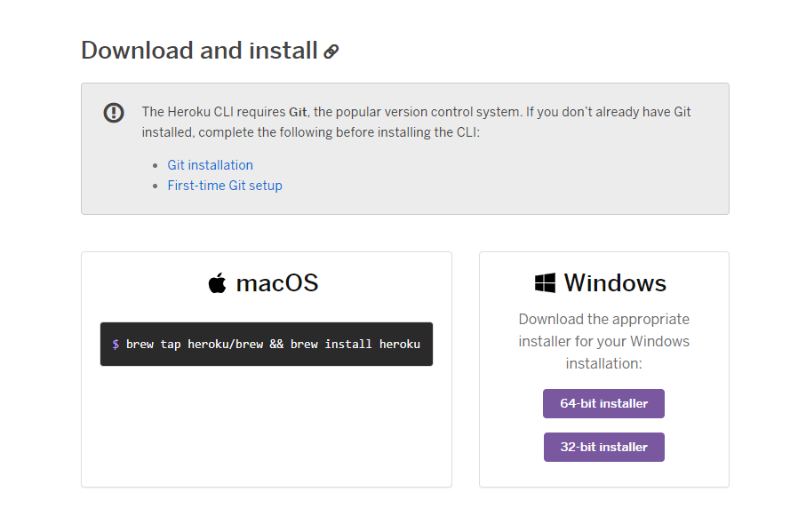

# BÀI THU HOẠCH CHƯƠNG 4 - HỌC PHẦN : ĐIỆN TOÁN ĐÁM MÂY VÀ ỨNG DỤNG
Sinh viên thực hiện : Nguyễn Minh Thông -
Mã sinh viên : 1821050949
Mục tiêu : Tạo ra một tài liệu hướng dẫn triển khai ứng dụng web trên nền tảng dịch vụ điện toán đám mây.
## Giới thiệu
**Heroku Web App** là một nền tảng đám mây cho phép các lập trình viên xây dựng, triển khai, quản lý và mở rộng ứng dụng (Paas - Platform as a service). Chúng ta có thể liên kết với tài khoản github để dễ dàng thay đổi thực hiện ngay trong **Github Actions**.
Trong bài viết này tôi sẽ tạo ra một "tài liệu" hướng dẫn các bạn tiến hành xây dụng một ứng dụng web và triển khai nó theo giải pháp điện toán đám mây **Heroku**.

Đây là ứng dụng mà tôi sẽ xây dựng trong bài viết này.

Sau khi xem "tài liệu" này xong thì bạn sẽ thực hiện được một số việc với Heroku.

## Mở đầu
Heroku cung cấp dịch vụ máy chủ đám mây giúp dễ dàng trong việc deploy ứng dụng. Điều tuyệt vời ở Heroku là rang này bạn có thể sử dụng dịch vụ hoàn toàn miễn phí với các ứng dụng web không yêu cầu phải có tốc độ truy câp dung lương lớn.
Trong bài viết này chúng ta sẽ cùng làm với nhau 4 việc :
- Tải Heroku CLI
- Tạo một dự án trên Heroku
- Cấu hình Git server repository cho phía local
- Deploy ứng dụng

## Tải Heroku CLI
Các bạn truy cập vào đường link [The Heroku CLI](https://devcenter.heroku.com/articles/heroku-cli) để tải Heroku CLI về máy. Chọn các phiên bản phù hợp với thiết bị của bạn. Có rất nhiều phiên bản để các bạn lựa chọn.

## Tạo dự án trên Heroku
Để tạo dự án trên *Heroku*, bạn cần tạo một tài khoản (hoàn toàn miễn phí) sau đó kích hoạt và đăng nhập 