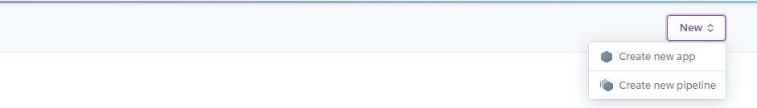
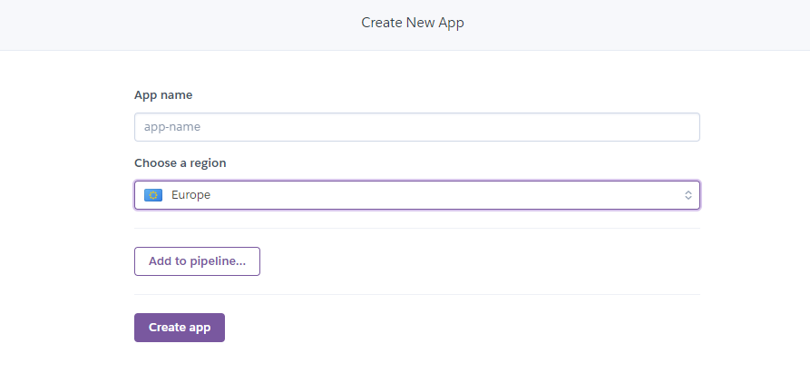

# BÀI THU HOẠCH CHƯƠNG 4 - HỌC PHẦN : ĐIỆN TOÁN ĐÁM MÂY VÀ ỨNG DỤNG
- Sinh viên thực hiện : Nguyễn Minh Thông
- Mã sinh viên : 1821050949
- Mục tiêu : Tạo ra một tài liệu hướng dẫn triển khai ứng dụng web trên nền tảng dịch vụ điện toán đám mây.
## Giới thiệu
**Heroku Web App** là một nền tảng đám mây cho phép các lập trình viên xây dựng, triển khai, quản lý và mở rộng ứng dụng (Paas - Platform as a service). Chúng ta có thể liên kết với tài khoản github để dễ dàng thay đổi thực hiện ngay trong **Github Actions**.
Trong bài viết này tôi sẽ tạo ra một "tài liệu" hướng dẫn các bạn tiến hành xây dụng một ứng dụng web và triển khai nó theo giải pháp điện toán đám mây **Heroku**.

Đây là ứng dụng mà tôi sẽ xây dựng trong bài viết này.

Sau khi xem "tài liệu" này xong thì bạn sẽ thực hiện được một số việc với Heroku.

## Mở đầu
Heroku cung cấp dịch vụ máy chủ đám mây giúp dễ dàng trong việc deploy ứng dụng. Điều tuyệt vời ở Heroku là trang này bạn có thể sử dụng dịch vụ hoàn toàn miễn phí với các ứng dụng web không yêu cầu phải có tốc độ truy câp dung lương lớn.
Trong bài viết này chúng ta sẽ cùng làm với nhau 4 việc :
- Tải Heroku CLI
- Tạo một dự án trên Heroku
- Cấu hình Git server repository cho phía local
- Deploy ứng dụng

## Điều kiện tiên quyết
- Có tài khoản [GitHub](https://github.com/)
- Có tài khoản [Heroku](https://dashboard.heroku.com/)
- Môi trường viết mã [Visual Studio Code](https://code.visualstudio.com/)

## Tải Heroku CLI
Các bạn truy cập vào đường link [The Heroku CLI](https://devcenter.heroku.com/articles/heroku-cli) để tải Heroku CLI về máy. Chọn các phiên bản phù hợp với thiết bị của bạn. Có rất nhiều phiên bản để các bạn lựa chọn.

## Tạo dự án trên Heroku
Để tạo dự án trên *Heroku*, bạn cần tạo một tài khoản (hoàn toàn miễn phí) sau đó kích hoạt và đăng nhập vào địa chỉ [https://dashboard.heroku.com/](https://dashboard.heroku.com/). Sau khi đăng nhập vào địa chỉ này, bạn sẽ thấy một nút New dùng để tạo một dự án. Click vào sau đó chọn Create New App :

Trong mục *App Name* chọn tên cho ứng dụng nếu bạn để trống thì Heroku sẽ chọn ngẫu nhiên một tên cho ứng dụng của bạn. Tiếp theo có hai lựa chọn để chọn vùng cho server Heroku sẽ host ứng dụng là Mỹ và Châu Âu. Với các ứng dụng ở Việt Nam tôi khuyên các bạn nên chọ khu vực *Europe* để có thể nâng cao tốc độ truy cập. Sau đó các bạn chọn *Create app*.

## Tạo Git Repository trên máy Local
Đầu tiên các bạn tải cho tôi phần mềm GIT để thuận tiện cho việc deploy ứng dụng web. Đường link để tải tôi sẽ để tại đây [ Click vào đây để download GIT về máy tính](https://git-scm.com/)

